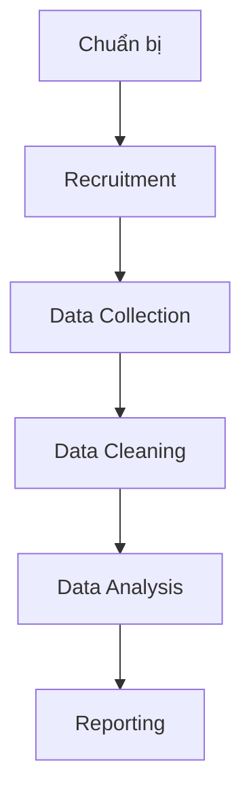

# ⚙️ [Tên Phương Pháp] - Implementation Process
## Quy Trình Thực Hiện

> **🎯 Mục tiêu:** Hướng dẫn từng bước để thực hiện nghiên cứu từ A đến Z.

---

## 📋 Tổng Quan Quy Trình



---

## 🚀 PHASE 1: Chuẩn Bị (Preparation)

### Step 1.1: Finalize Research Instruments
**Checklist:**
- [ ] Review questionnaire/guide với stakeholders
- [ ] Pilot test với 5-10 respondents
- [ ] Incorporate feedback từ pilot
- [ ] Final approval từ IRB/Ethics committee (nếu cần)

**Output:** ✅ Final version của questionnaire/guide

---

### Step 1.2: Setup Data Collection Infrastructure
**Technical setup:**
- [ ] [Setup platform/tool - ví dụ: Qualtrics, Google Forms, etc.]
- [ ] Configure data routing & logic
- [ ] Setup data storage (secure & GDPR compliant)
- [ ] Create backup system

**Output:** ✅ Ready-to-use data collection system

---

### Step 1.3: Prepare Materials
**Documents cần in/chuẩn bị:**
- [ ] Consent forms (in sao [X] bản)
- [ ] Information sheets
- [ ] Incentive/compensation tracking sheet
- [ ] Data collection checklist
- [ ] [Các materials khác specific cho phương pháp]

**Output:** ✅ Complete material package

---

## 👥 PHASE 2: Recruitment (Tuyển mộ người tham gia)

### Step 2.1: Define Recruitment Strategy
**Channels:**
- [ ] [Channel 1 - ví dụ: Social media ads]
- [ ] [Channel 2 - ví dụ: Email outreach]
- [ ] [Channel 3 - ví dụ: Panel providers]
- [ ] [Channel 4 - ví dụ: Snowball sampling]

**Messaging:**
```
[Template recruitment message]

Subject: [Subject line]

Body:
[Content của recruitment message]

CTA: [Call to action]
```

---

### Step 2.2: Screening Process
**Screening criteria:**
1. [Tiêu chí 1]: [Cách kiểm tra]
2. [Tiêu chí 2]: [Cách kiểm tra]
3. [Tiêu chí 3]: [Cách kiểm tra]

**Screening flow:**
```
Respondent arrives → Screening questions →
→ Pass? → Schedule/Proceed
→ Fail? → Thank & disqualify (with soft message)
```

**Template reject message:**
```
[Message từ chối lịch sự cho respondents không đủ tiêu chí]
```

---

### Step 2.3: Scheduling & Confirmation
**For qualitative methods:**
- [ ] Send calendar invite với Zoom/meeting link
- [ ] Send reminder 24h trước
- [ ] Send reminder 1h trước
- [ ] Prepare backup respondents

**For quantitative methods:**
- [ ] Send survey link
- [ ] Set reminder automation (after 3 days, 7 days)
- [ ] Monitor response rate daily

---

## 📊 PHASE 3: Data Collection

### Step 3.1: Pre-Collection Checklist
**Trước mỗi session/wave:**
- [ ] Test all equipment/technology
- [ ] Review protocol & script
- [ ] Prepare incentives/compensation
- [ ] Setup recording (với consent)
- [ ] [Các items specific cho phương pháp]

---

### Step 3.2: During Collection - Best Practices

#### For Qualitative:
**Opening:**
1. Chào đón & tạo rapport (2-3 phút)
2. Giải thích mục đích nghiên cứu
3. Thu informed consent
4. Giải thích về recording & confidentiality
5. Khuyến khích thành thật & không có câu trả lời đúng/sai

**During:**
- ✅ Follow guide nhưng flexible với flow tự nhiên
- ✅ Probe deeper khi cần: "Can you tell me more about that?"
- ✅ Note non-verbal cues
- ✅ Keep neutral, không leading questions

**Closing:**
- Thank participants
- Trao incentive
- Debrief nếu cần

#### For Quantitative:
**Quality checks:**
- [ ] Monitor completion rate
- [ ] Check for response patterns (straight-lining)
- [ ] Review open-ended responses for nonsense
- [ ] Track average completion time
- [ ] Identify & remove bots/bad actors

---

### Step 3.3: Documentation
**Sau mỗi session/day:**
- [ ] Field notes/memos
- [ ] Log any issues/deviations
- [ ] Update recruitment tracker
- [ ] Backup data immediately
- [ ] Update progress report

**Template field notes:**
```
Date: [DD/MM/YYYY]
Session ID: [ID]
Participant: [Anonymous ID]

Key observations:
-
-

Issues encountered:
-
-

Notes for next session:
-
-
```

---

## 🧹 PHASE 4: Data Cleaning & Preparation

### Step 4.1: Initial Data Check
**Import data vào R:**
```r
# Load libraries
library(tidyverse)
library(here)

# Import data
raw_data <- read.csv(here("data", "raw_data.csv"))

# Quick overview
glimpse(raw_data)
summary(raw_data)
```

---

### Step 4.2: Data Cleaning Steps

**Checklist:**
- [ ] Remove duplicate responses
- [ ] Remove incomplete responses
- [ ] Remove failed attention checks
- [ ] Remove speeders (too fast completion)
- [ ] Handle missing data
- [ ] Recode variables if needed
- [ ] Create new variables/scales

**R code mẫu:**
```r
# [Sẽ có code chi tiết trong 06-Analysis-Code.R]

# Example:
clean_data <- raw_data %>%
  filter(!duplicated(ResponseID)) %>%
  filter(Finished == TRUE) %>%
  filter(Duration > 120) %>%  # Remove speeders
  # ... more cleaning steps
```

**Output:** ✅ Clean dataset for analysis

---

### Step 4.3: Data Validation
**Quality checks:**
- [ ] Check sample demographics vs target
- [ ] Check variable distributions
- [ ] Check for outliers
- [ ] Verify scale reliabilities (Cronbach's alpha)

**Prepare for analysis:**
- [ ] Export clean data
- [ ] Document all cleaning decisions
- [ ] Create codebook

---

## 📈 PHASE 5: Data Analysis

### Step 5.1: Descriptive Statistics
```r
# Sample statistics
# [Code sẽ có trong 06-Analysis-Code.R]
```

**Output tables:**
- Demographics table
- Descriptive statistics table

---

### Step 5.2: Main Analysis
**Analysis plan:**
1. [Analysis method 1]: [Mục đích]
2. [Analysis method 2]: [Mục đích]
3. [Analysis method 3]: [Mục đích]

**R packages cần dùng:**
- `tidyverse` - Data manipulation
- `psych` - Psychometric analysis
- `[package 1]` - [Purpose]
- `[package 2]` - [Purpose]

**Chi tiết code:** Xem [06-Analysis-Code.R](06-Analysis-Code.R)

---

### Step 5.3: Visualization
**Charts cần tạo:**
- [ ] [Chart type 1] - [Purpose]
- [ ] [Chart type 2] - [Purpose]
- [ ] [Chart type 3] - [Purpose]

**Dashboard:** Xem [07-Dashboard/](07-Dashboard/)

---

## 📝 PHASE 6: Reporting

### Step 6.1: Structure Report
**Recommended outline:**
1. **Executive Summary**
   - Key findings (bullet points)
   - Recommendations

2. **Methodology**
   - Sample description
   - Data collection process
   - Limitations

3. **Findings**
   - [Finding 1]
   - [Finding 2]
   - [Finding 3]

4. **Conclusions & Recommendations**
   - [Recommendation 1]
   - [Recommendation 2]

---

### Step 6.2: Visualize Key Findings
**Best practices:**
- ✅ Use clear, simple charts
- ✅ Highlight key insights
- ✅ Include sample quotes (for qualitative)
- ✅ Use brand colors if applicable

---

### Step 6.3: Present & Deliver
**Deliverables checklist:**
- [ ] Final report (PDF)
- [ ] Executive summary (PPT)
- [ ] Raw data (anonymized)
- [ ] Clean data + codebook
- [ ] R scripts
- [ ] Dashboard (if applicable)

---

## ⚠️ Common Pitfalls & How to Avoid

| Pitfall | Hậu quả | Cách tránh |
|---------|---------|------------|
| [Pitfall 1] | [Hậu quả] | [Solution] |
| [Pitfall 2] | [Hậu quả] | [Solution] |
| [Pitfall 3] | [Hậu quả] | [Solution] |

---

## 🔧 Troubleshooting

### Issue 1: [Tên issue]
**Triệu chứng:** [Mô tả]

**Solutions:**
1. [Solution 1]
2. [Solution 2]

### Issue 2: [Tên issue]
**Triệu chứng:** [Mô tả]

**Solutions:**
1. [Solution 1]
2. [Solution 2]

---

## ✅ Final Checklist

- [ ] Data collection completed
- [ ] Data cleaned & validated
- [ ] Analysis completed
- [ ] Results interpreted
- [ ] Report written
- [ ] Stakeholders presented to
- [ ] Data archived securely
- [ ] Participant compensation completed

---

## ➡️ Bước Tiếp Theo

- 💻 Xem [06-Analysis-Code.R](06-Analysis-Code.R) để chạy analysis
- 📊 Xem [07-Dashboard/](07-Dashboard/) để visualize kết quả
- 📚 Tham khảo [08-References/](08-References/) để đọc thêm
